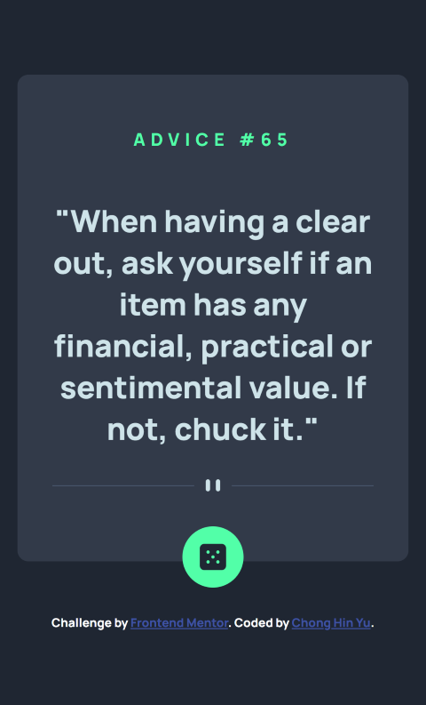
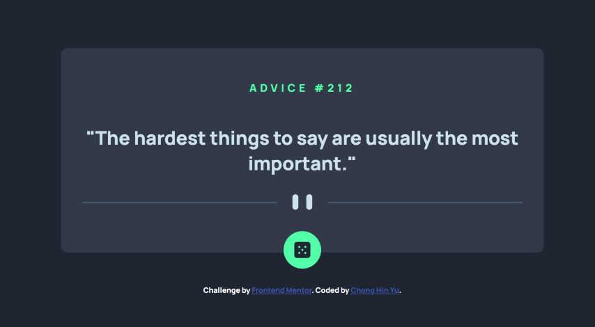

# Frontend Mentor - Advice generator app solution

This is a solution to the [Advice generator app challenge on Frontend Mentor](https://www.frontendmentor.io/challenges/advice-generator-app-QdUG-13db). Frontend Mentor challenges help you improve your coding skills by building realistic projects.

## Overview

Completed the Advice generator app using HTML, CSS, JavaScript and using the [Advice Slip API](https://api.adviceslip.com).

I used Flexbox for the layouts of the page with a mobile first approach.

Clicking on the dice icon will generate a new advice. Added a loading text in case it takes a bit longer to get new advice.

### The challenge

Users should be able to:

- View the optimal layout for the app depending on their device's screen size
- See hover states for all interactive elements on the page
- Generate a new piece of advice by clicking the dice icon

### Screenshot

Mobile
 

Mobile active state
 

Desktop
 

Desktop
 

### Links

- Live Site URL: [Advice Generator app](https://hin274.github.io/advice-generator-app-main/)

## Author

- Frontend Mentor - [@hin274](https://www.frontendmentor.io/profile/Hin274)
